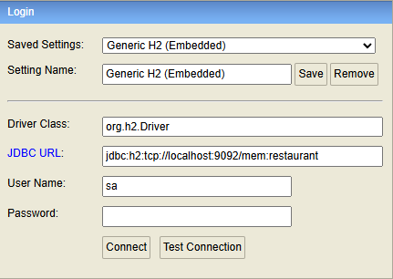

# Conectare DB dupa app start

### browser -> localhost:8082
### JDBC URL: 
jdbc:h2:tcp://localhost:9092/mem:restaurant
### username:
sa
### password:
[empty]

### Db schema se gaseste in:
src/main/resources/schema.sql